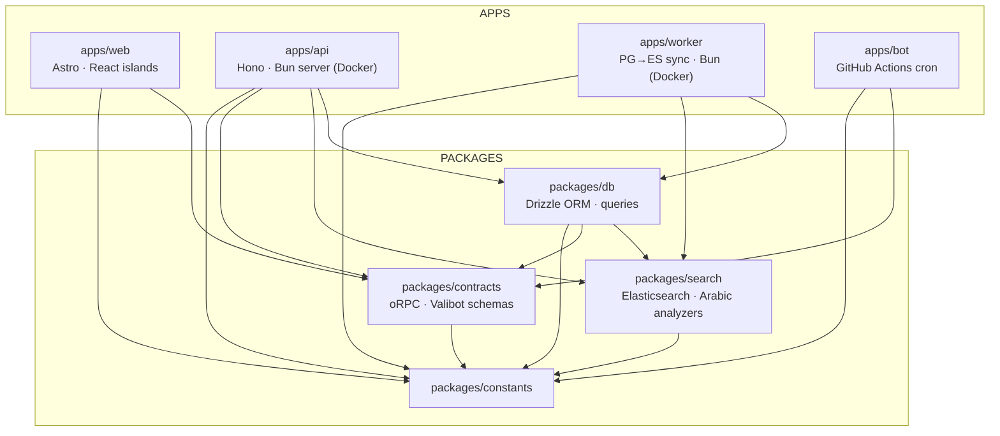
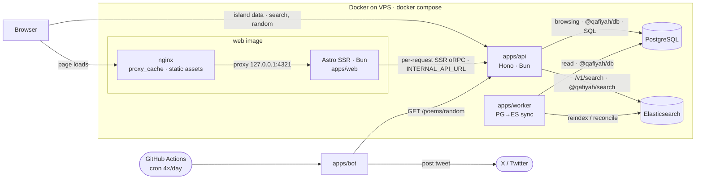

<div align="center">

# Qafiyah

<picture>
  <source media="(prefers-color-scheme: dark)" srcset=".github/readme_banner_darkmode.webp" />
  <source media="(prefers-color-scheme: light)" srcset=".github/readme_banner_lightmode.webp" />
  
</picture>

**Open-source repository of Arabic poetry with database dumps, REST API, and web interface.**

[](https://turbo.build/repo)
[](https://www.docker.com)
[](https://astro.build)
[](https://bun.sh)
[](https://www.typescriptlang.org)
[](https://hono.dev)
[](https://orm.drizzle.team)
[](https://api.qafiyah.com)
[](https://orpc.unnoq.com)
[](https://valibot.dev)
[](https://scalar.com)

[Website](https://qafiyah.com) · [API](https://api.qafiyah.com) · [X Bot](https://x.com/qafiyahx) · [Database Dumps](dumps/)

</div>

## About

Qafiyah is an open-source corpus of classical Arabic poetry spanning the major historical eras. It offers full-text Arabic search (Elasticsearch); faceted browsing by era, meter, rhyme letter, theme, and collection; a public REST API with auto-generated OpenAPI docs; and downloadable PostgreSQL dumps. An X bot posts a random poems daily. Built for readers, researchers, and developers working with classical Arabic literature.

## Try it

One request, no auth, returns a random classical Arabic poem as plain text.

```bash
curl https://api.qafiyah.com/v1/poems/random?option=lines
```

Full schema and interactive playground: [`api.qafiyah.com/v1/docs`](https://api.qafiyah.com/v1/docs).

## Table of Contents

- [Qafiyah](#qafiyah)
  - [About](#about)
  - [Try it](#try-it)
  - [Table of Contents](#table-of-contents)
  - [Tech Stack](#tech-stack)
    - [Core](#core)
    - [Web (`apps/web`)](#web-appsweb)
    - [API (`apps/api`)](#api-appsapi)
    - [Bot (`apps/bot`)](#bot-appsbot)
    - [Data Layer](#data-layer)
    - [Search](#search)
    - [Tooling](#tooling)
  - [Architecture](#architecture)
  - [Database](#database)
  - [Getting Started](#getting-started)
    - [Prerequisites](#prerequisites)
    - [Installation](#installation)
    - [Development](#development)
  - [Scripts](#scripts)
  - [Rate Limits and Terms of Use](#rate-limits-and-terms-of-use)
  - [Documentation](#documentation)
  - [Sponsor](#sponsor)
  - [License](#license)

## Tech Stack

### Core

| Tool                                                   | Purpose                                                     |
| ------------------------------------------------------ | ----------------------------------------------------------- |
| [Bun](https://bun.sh)                                  | Package manager and JavaScript runtime                      |
| [Turborepo](https://turbo.build)                       | Monorepo task orchestration and build caching               |
| [TypeScript](https://www.typescriptlang.org)           | Language across all packages                                |
| [envin](https://github.com/nktnet1/envin)              | Type-safe environment variable loading and parsing          |
| [ts-pattern](https://github.com/gvergnaud/ts-pattern)  | Exhaustive, type-safe pattern matching used across all apps |
| [neverthrow](https://github.com/supermacro/neverthrow) | Typed `Result` for fallible logic at module boundaries      |

### Web (`apps/web`)

| Tool                                                                                                 | Purpose                                                         |
| ---------------------------------------------------------------------------------------------------- | --------------------------------------------------------------- |
| [Astro](https://astro.build)                                                                         | SSR framework (`output: 'server'`); pages rendered per request  |
| [@astrojs/node](https://docs.astro.build/en/guides/integrations-guide/node/)                         | Standalone Node adapter; runs the SSR server under Bun          |
| [React](https://react.dev)                                                                           | Interactive islands (search, nav, random poem)                  |
| [TailwindCSS](https://tailwindcss.com)                                                               | Utility-first CSS                                               |
| [Radix Slot](https://www.radix-ui.com)                                                               | Polymorphic-render primitive for component composition          |
| [TanStack Query](https://tanstack.com/query)                                                         | Server-state and data-fetching in React islands                 |
| [nuqs](https://nuqs.47ng.com)                                                                        | Type-safe URL search-param state for React islands              |
| [lucide-react](https://lucide.dev)                                                                   | Icon set used throughout the UI                                 |
| [clsx](https://github.com/lukeed/clsx) + [tailwind-merge](https://github.com/dcastil/tailwind-merge) | Conditional class composition with Tailwind conflict resolution |
| [class-variance-authority](https://cva.style)                                                        | Typed variant API for component styling                         |

### API (`apps/api`)

| Tool                                | Purpose                                                         |
| ----------------------------------- | --------------------------------------------------------------- |
| [Hono](https://hono.dev)            | Lightweight HTTP framework running on a Bun server (Docker)     |
| [oRPC](https://orpc.unnoq.com)      | Type-safe RPC with shared contracts                             |
| [Valibot](https://valibot.dev)      | Schema validation for all oRPC contract inputs and outputs      |
| [OpenAPI](https://www.openapis.org) | API spec auto-generated from oRPC contracts via `@orpc/openapi` |
| [Scalar](https://scalar.com)        | Interactive API documentation served at `/v1/docs`              |
| [Docker](https://www.docker.com)    | Container runtime; API and web served via Docker Compose        |

### Bot (`apps/bot`)

| Tool                                                            | Purpose                                |
| --------------------------------------------------------------- | -------------------------------------- |
| [GitHub Actions](https://github.com/features/actions)           | Cron scheduler and runtime for the bot |
| [twitter-api-v2](https://github.com/PLhery/node-twitter-api-v2) | X/Twitter API client                   |

### Data Layer

| Tool                                                | Purpose                                                               |
| --------------------------------------------------- | --------------------------------------------------------------------- |
| [Drizzle ORM](https://orm.drizzle.team)             | SQL query builder and schema definitions in `packages/db`             |
| [postgres.js](https://github.com/porsager/postgres) | Underlying Postgres client that Drizzle wraps                         |
| [PostgreSQL](https://www.postgresql.org)            | Primary datastore and source of truth (browsing queries, dump source) |
| [Docker](https://www.docker.com)                    | Local Postgres and Elasticsearch containers for development           |

### Search

| Tool                                                                  | Purpose                                                                    |
| --------------------------------------------------------------------- | -------------------------------------------------------------------------- |
| [Elasticsearch](https://www.elastic.co/elasticsearch)                 | Full-text Arabic search engine; powers `/v1/search` (`packages/search`)    |
| [@elastic/elasticsearch](https://github.com/elastic/elasticsearch-js) | ES client; forced `HttpConnection` transport for Bun compatibility         |
| [apps/worker](apps/worker)                                            | Syncs Postgres → Elasticsearch: boot reindex (if empty) + weekly reconcile |

### Tooling

| Tool                                                                 | Purpose                                                   |
| -------------------------------------------------------------------- | --------------------------------------------------------- |
| [Biome](https://biomejs.dev)                                         | Linting and formatting for all JS/TS files                |
| [Prettier](https://prettier.io)                                      | Formatting for non-JS assets                              |
| [Vitest](https://vitest.dev)                                         | Unit and integration tests across all workspaces          |
| [Husky](https://typicode.github.io/husky)                            | Git hooks                                                 |
| [commitlint](https://commitlint.js.org)                              | Conventional commit enforcement                           |
| [Knip](https://knip.dev)                                             | Detection of unused files, dependencies, and exports      |
| [Madge](https://github.com/pahen/madge)                              | Circular dependency detection                             |
| [dependency-cruiser](https://github.com/sverweij/dependency-cruiser) | Architectural import rules across `apps/` and `packages/` |
| [Syncpack](https://jamiemason.github.io/syncpack)                    | Cross-workspace dependency version consistency            |

## Architecture

Bun + Turborepo monorepo: four apps and five shared packages.

```
qafiyah/
├── apps/
│   ├── web/          Astro on-demand SSR (Bun + @astrojs/node) behind nginx proxy_cache; renders each route per request by fetching the API via oRPC
│   ├── api/          Hono REST API (browsing + /v1/search), Bun server (Docker container)
│   ├── worker/       Postgres→Elasticsearch sync (boot reindex + weekly reconcile), Bun server (Docker container)
│   └── bot/          X/Twitter bot; posts 4× daily via GitHub Actions cron
└── packages/
    ├── db/           Drizzle ORM schema, queries, and Postgres client factory
    ├── search/       Elasticsearch client, Arabic analyzers/mappings, query + reindex/reconcile
    ├── contracts/    Shared oRPC contract definitions
    ├── constants/    Shared brand, URLs, and dev-port constants
    └── typescript/   Shared TypeScript configs (base, astro, bun)
```

**Package dependencies**, who imports whom at compile time:



`packages/typescript` ships shared tsconfig presets (`base`, `astro`, `bun`) consumed via `extends`, not code imports; omitted from the graph above.

**Two architectural constraints.** `packages/db` is consumed only by `apps/api` and `apps/worker`; no Drizzle or Postgres imports exist under `apps/web` or `apps/bot`. `apps/web` has no DB access: it renders each route on demand (SSR), querying the API per request through server-only oRPC accessors in `src/lib/server/` (pointed at `INTERNAL_API_URL`), while browser islands fetch the public API via `src/lib/api/` (`rpc.ts`, `client.ts`, `orpc.ts`).

**Runtime data flow**, how requests move once deployed:



Everything inside **Docker on VPS** ships from `docker-compose.yml` (`docker compose up -d --build` or `bun run deploy`): Postgres, Elasticsearch, `api`, `worker`, and the web image. The web image bundles nginx (proxy_cache + static assets) in front of the Astro SSR server; the SSR server reaches `api` over the internal network (`INTERNAL_API_URL`). The `api` reads Postgres for browsing and Elasticsearch for `/v1/search`; the `worker` keeps Elasticsearch in sync with Postgres (boot reindex + weekly reconcile). Browser islands call the public API directly. The bot runs on GitHub Actions, outside the VPS.

## Database

The corpus is modeled as poems and verses, organized by poet, era, meter, rhyme letter, theme, and collection. Live counts come from the data, not this README.

PostgreSQL custom-format dumps are published in [`dumps/`](dumps) and refreshed periodically. They are provided for research and integration as an alternative to scraping the API; see the [restore instructions](dumps/README.md).

## Getting Started

### Prerequisites

- Bun (version pinned via the root `packageManager` field)
- Docker (runs Postgres, Elasticsearch, and the apps)
- PostgreSQL with `pg_restore` (only needed for restoring dumps directly; the Dockerized workflow handles this automatically)

### Installation

```bash
git clone https://github.com/alwalxed/qafiyah.git
cd qafiyah
bun install
```

### Development

```bash
bun run dev        # seeded Postgres + Elasticsearch + worker (Docker) + hot-reloading web & API
```

`dev` brings up the database and Elasticsearch containers (DB auto-seeded on first boot; the worker reindexes Elasticsearch if its alias is empty), writes the local `.env` files, then starts the dev servers. For a full containerized run, use `bun run up`.

## Scripts

**Dev and build**

| Script             | Description                                                              |
| ------------------ | ------------------------------------------------------------------------ |
| `bun run dev`      | Seeded Postgres + Elasticsearch + worker (Docker) + web & API hot reload |
| `bun run up`       | Build + run the full stack in Docker (DB self-seeds on first boot)       |
| `bun run down`     | Stop the Docker stack                                                    |
| `bun run deploy`   | Push-button production deploy: sync the VPS to `origin/main` and rebuild |
| `bun run build`    | Build all workspaces                                                     |
| `bun run db:up`    | Start just the Postgres container (auto-seeds on a fresh volume)         |
| `bun run db:reset` | Wipe the DB volume and re-seed from the latest dump                      |
| `bun run es:up`    | Start just the Elasticsearch container                                   |
| `bun run es:down`  | Stop the Elasticsearch container                                         |
| `bun run reindex`  | Rebuild the Elasticsearch index from Postgres and swap the alias         |
| `bun run clean`    | Kill orphan Astro and API server processes from prior dev runs           |

**Quality**

| Script              | Description                                                                           |
| ------------------- | ------------------------------------------------------------------------------------- |
| `bun run test`      | Run Vitest across all workspaces                                                      |
| `bun run types`     | Type-check all workspaces with `tsc --noEmit`                                         |
| `bun run lint`      | Lint and auto-fix with Biome                                                          |
| `bun run format`    | Format JS/TS with Biome and Markdown/MDX with Prettier                                |
| `bun run knip`      | Detect unused files, dependencies, and exports                                        |
| `bun run madge`     | Detect circular imports across `apps/` and `packages/`                                |
| `bun run depcruise` | Run `dependency-cruiser` against the architectural rules in `.dependency-cruiser.cjs` |

**Boundary checks**

| Script                            | Description                                                                         |
| --------------------------------- | ----------------------------------------------------------------------------------- |
| `bun run check:boundaries`        | Forbid cross-app imports (apps may not import from each other)                      |
| `bun run check:naming`            | Enforce project-wide naming conventions on files and identifiers                    |
| `bun run check:no-parent-imports` | Forbid `../` imports anywhere; siblings or `@/` aliases only                        |
| `bun run check:api-db-isolation`  | Forbid Drizzle or `postgres` imports outside `packages/db`                          |
| `bun run check:constants`         | Ensure brand strings, URLs, and ports live in `packages/constants`, not in app code |
| `bun run check:syncpack`          | Verify dependency versions are consistent across all workspaces                     |

**Aggregate and utilities**

| Script                                     | Description                                                                                                                                                         |
| ------------------------------------------ | ------------------------------------------------------------------------------------------------------------------------------------------------------------------- |
| `bun run ci`                               | Full pipeline: format and lint sequentially, then run types, test, knip, madge, all six boundary checks, depcruise, `bun audit`, and the API smoke test in parallel |
| `bun run smoke`                            | Spin up the API locally and hit each public endpoint to catch breakage in the request path                                                                          |
| `bun run deps:doctor`                      | Diagnose and update workspace dependencies                                                                                                                          |
| `bun run optimize:images`                  | Convert raster images in the repo to sibling `.webp` files using [Bun.Image](https://bun.com/docs/runtime/image)                                                    |
| `bun --filter @qafiyah/web run verify:seo` | Crawl the running web server and assert SEO parity (canonical URLs, JSON-LD, metadata) across rendered pages                                                        |

## Rate Limits and Terms of Use

The API is free, requires no authentication, and is provided on a best-effort basis with no SLA.

- **Fair use.** Per-IP throttling is enforced at the server level. For bulk access, prefer the [PostgreSQL dumps](dumps/) over paginating the API.
- **Caching.** Responses are cacheable; cache them client-side when possible to reduce load.
- **Stability.** `v1` endpoints are stable. Breaking changes ship behind a new major version.
- **Attribution.** Not required, but appreciated if you publish work that relies on the corpus.

## Documentation

- [Search Implementation](docs/SEARCH_FEATURE_IMPLEMENTATION.md)
- [Deployment](docs/DEPLOYMENT.md)
- [Contributing Guidelines](.github/CONTRIBUTING.md)
- [Code of Conduct](.github/CODE_OF_CONDUCT.md)
- [Security Policy](.github/SECURITY.md)

## Sponsor

If Qafiyah is useful to you, support the project on [GitHub Sponsors](https://github.com/sponsors/alwalxed). Sponsorship funds dataset upkeep, API hosting, and ongoing maintenance.

## License

Released under the [MIT License](LICENSE).
